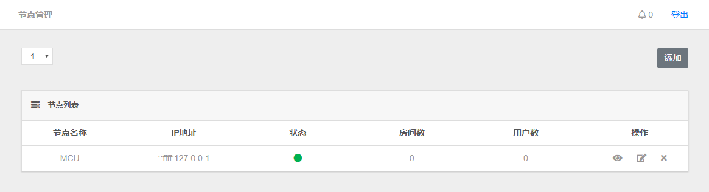
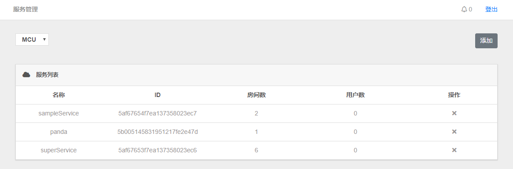
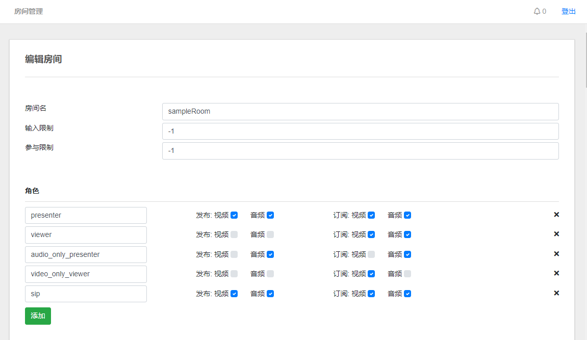

Create high-performance, reliable, and scalable real-time communication solutions. Server and client tools to deliver RTC experiences with video conferencing capabilities. Optimized for Intel® Architecture to take full advantage of Intel hardware-acceleration with H.264 and HEVC encode/decode.


# Version

* 0.0.1 Nightly.

## Module dependencies

* [arguments.type](https://github.com/xivistudios/arguments.type).
* [axios](https://github.com/axios/axios).
* [body-parser](https://github.com/expressjs/body-parser).
* [cookie-parser](https://github.com/expressjs/cookie-parser).
* [cookie-session](https://github.com/expressjs/cookie-session).
* [ejs](https://github.com/tj/ejs).
* [express](https://github.com/expressjs/express).
* [mongodb](https://github.com/mongodb/node-mongodb-native).
* [nodemailer](https://github.com/nodemailer/nodemailer).
* [redis](https://github.com/NodeRedis/node_redis).
* [toml](https://github.com/BinaryMuse/toml-node).
* [ws](https://github.com/websockets/ws).

## About

* Node.JS Version >= 8.1.
* This service need MongoDB and Redis.
* The service can be run independently, **Intel WebRTC MCU** needs to connect to this service, managed by this service.
* This service provides a remote call API.
* This service requires runtime injection of **Intel WebRTC MCU**.

## Install

You neead install npm package.

```console
~ npm install
```

You need to create a new configuration file.

```console
~ vim ./configure.toml
```

```console
# http configure
[http]
# you web host
host = "localhost"
# you need listen port
port = 80
# http origin
origin = "http://localhost"
# html view files
views = "./page/html"
# html static public files
public = "./page/public"

# http session configure
[session]
name = ""
maxAge = 0
keys = []

# mongodb configure
[mongodb]
host = "127.0.0.1"
port = 27017
dbname = "console"
document = [
  "admin",
  "log",
  "system",
  "cluster"
]

# mongodb auth configure
# !when you need to fill in the certification
[mongodb.auth]
user = ""
password = ""

# redis configure
[redis]
host = "127.0.0.1"
port = 6379
password = ""

# crypto configure
[crypto]
type = "aes256"
key = ""

# email service configure
[nodemailer]
service = "smtp.qq.com"
host = "smtp.qq.com"
port = 465
secureConnection = true
secure = true

# email service auth configure
[nodemailer.auth]
user = ""
pass = ""

# intel webrtc mcu listen configure
[service]
port = 88
router = "/masterApi"

# log configure
[log]
path = "./mcu.log"
```

Save this configuration file.
next.
You need to create a new default management account in the database.

```console
~ mongo
use console
db.admin.insert({ username: "root", password: "root" })
```

You can now login to this service with this newly created default admin account.
next.
Start this Service.

```console
~ node index.js
```

or use pm2

```console
~ pm2 start index.js -i auto
```

Now please start enjoying!


## Instructions for use

* Console included Brief information report for the entire service.


* Cluster node new, edit, status view.



* View server information.


* WebRTC service list view edit add.



* Rooms list view edit add.


* Room edit.




## MIT License

Copyright (c) 2018 Mr.Panda.

Permission is hereby granted, free of charge, to any person obtaining a copy
of this software and associated documentation files (the "Software"), to deal
in the Software without restriction, including without limitation the rights
to use, copy, modify, merge, publish, distribute, sublicense, and/or sell
copies of the Software, and to permit persons to whom the Software is
furnished to do so, subject to the following conditions:

The above copyright notice and this permission notice shall be included in all
copies or substantial portions of the Software.

THE SOFTWARE IS PROVIDED "AS IS", WITHOUT WARRANTY OF ANY KIND, EXPRESS OR
IMPLIED, INCLUDING BUT NOT LIMITED TO THE WARRANTIES OF MERCHANTABILITY,
FITNESS FOR A PARTICULAR PURPOSE AND NONINFRINGEMENT. IN NO EVENT SHALL THE
AUTHORS OR COPYRIGHT HOLDERS BE LIABLE FOR ANY CLAIM, DAMAGES OR OTHER
LIABILITY, WHETHER IN AN ACTION OF CONTRACT, TORT OR OTHERWISE, ARISING FROM,
OUT OF OR IN CONNECTION WITH THE SOFTWARE OR THE USE OR OTHER DEALINGS IN THE
SOFTWARE.
